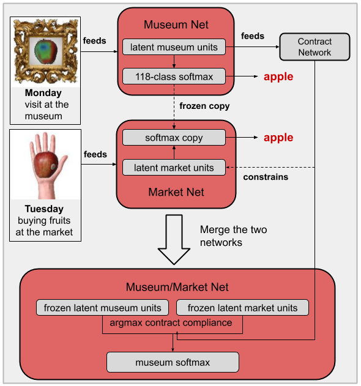
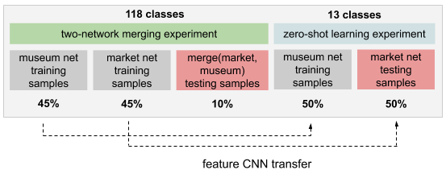

### Introduction

This is my second project tackling continual learning from a transfer learning angle.
The [first time](https://github.com/rom1mouret/inplastic) around, I trained a deep neural network so that it transfers well to classes that were not seen during training.
This was incremental learning of type [Class-IL](https://arxiv.org/pdf/1904.07734.pdf). 
In this project, my focus is on Domain-IL.

In a Domain-IL setting, the model learns from input distributions that have never been seen before, which any model is supposed to do.
What is [less trivial](https://en.wikipedia.org/wiki/Catastrophic_interference) is for the model to remember input distributions that are no longer being seen.
For example, you could train a neural network to recognize Yann LeCun in drawings.
A couple of weeks later, you want the same network to recognize Yann LeCun in photographs.
Of course, you don't want your network to forget about drawings in the process.

I will use this project as a platform to share some general ideas about continual learning.

### Building abstractions

In the early stages of your training, your model works with drawings only.
It doesn't yet recognize Yann LeCun. It recognizes *drawings* of Yann LeCun. 
It's only after seeing him in various contexts that your model will build an abstraction of Yann LeCun.
This is what Domain-IL arguably does: slowly building abstractions.

Domain-IL is less challenging than Class-IL.
Nonetheless, finding a scalable solution to Domain-IL would be a giant step towards developing general-purpose models by means of building and enriching abstractions.


### Architecture for Domain-IL

<div align="center">
  
</div>

The contract's main purpose is to assess whether latent values are self-consistent after passing through each CNN.
Self-consistency serves as a criterion to identify which domain the input belongs to.

The contract can also be utilized to constrain the market network during its training.
In this context, its purpose is two-fold.
1. Better alignment between the market and the museum networks.
2. More reliable use of the contract when trying to identify the input domain.

### Peek at the dataset


Those are a few images from the dataset.

The market images are built by copy-pasting a hand behind each image.

The museum images are transformed as follows:
- messing up with the colors with `ImageOps.solarize`.
- adding some Gaussian blur.
- copy-pasting a wooden frame in the background.

### Experimental setup

<div align="center">
  
</div>

We follow these steps:

1. We train a CNN and a 2-layer classifier to distinguish between 118 different kinds of fruits/vegetables from images that are stylized to mimic paintings, as if they were seen in a museum.
2. We train the contract network.
3. We train a network to classify the original images of fruit/vegetables using the same classifier but a different CNN.
4. Result A: we combine the two CNNs and see how the merged network performs on images from either domain.
5. We freeze the two CNNs and train a classifier to distinguish between new classes of fruits in the original domain.
6. Result B: we evaluate the classifier on the museum domain. The museum network hasn't been trained on these new classes, so what this is evaluating is the network's zero-shot learning capability.

Take a look at [experiment.py]() for more details.


### Results

| training constraints | merged network accuracy | zero-shot accuracy|
| -------------------- | ----------------------- | ----------------- |
| classifier+contract  | 85.2%                   | 79.5%             |
| classifier only      | 78.6%                   | 73.2%             |
| contract only        | 44.4%                   | 3.5%              |

Averaged over 5 rounds.

### Grounded representations

In conventional supervised learning, latent representations are shaped and "defined" by the tasks they are currently trained with.
Since tasks change over time, this is not a property we want for a continual learning system.

Another noticeable property is latent units' lack of individuation.
A unit might encode redness in a neural network.
In an identically-architected network trained from the same data with the same loss function, redness might also be encoded by a single artificial neuron but it is most likely encoded by a different one.
This comes into play when trying to merge or align multiple networks.

I think both problems can be alleviated by decoupling the "definition" of the latent units from the immediate tasks.
In my view, what "defines" a small group of latent units is what this group can reliably predict without any other latent unit`*`.
If a robot's latent unit encodes `the talking voice is a male voice`, the robot can reliably predict that the person talking is a *man*.
Now, if the robot meets a *man* whose voice doesn't sound like that of a man, the robot should update its voice recognition module.
In effect, the definition of `male voice` hasn't changed after updating the robot's software:
`male voice` is still what best predicts the gender of a person from his/her utterances.

Only this kind of in-person encounter warrants a refinement of `male voice`.
As for tasks that utilize the `male voice` unit but are not concerned with predicting the gender of the speaker,
they should not drive any update of the robot's voice recognition module, even if it yields better performance of the task at hand.
This is what I mean by decoupling tasks from the latent units they are using, with the exception of defining-tasks.
In fact, refining the `male voice` unit via a defining-task will likely improve any non-defining downstream task, rather than interfering in a destructive manner.

In this project, I have implemented this idea through two sorts of constraints.

1. The latent units are defined and individuated by how they are utilized to predict fruits/vegetables across different contexts.
Here, the softmax classifier acts as a constraint on the latent units' definition. Good zero-shot performance shows that the latent units have the same definition whether fruits are seen at the museum or at the market.
2. The contract network makes sure that the set of latent units does not contradict itself. This is not essential but it provides a small performance boost, as shown by the results.

In the future, I will consider other ways of constraining latent units, such as:
- Constraining them with lower-level tasks in a [curriculum learning](https://mila.quebec/wp-content/uploads/2019/08/2009_curriculum_icml.pdf) fashion.
For example, such lower-level tasks could consist of predicting simple features a la self-learning.
- Enforcing some statistical properties on the set of latent units besides linear correlations.
- Making sure latent units are always zeros or ones rather than fuzzy quantities. This opens the door to building logical contracts.


`*` Not a perfect characterization yet. It's a work in progress.

```diff
+ update: this new project https://github.com/rom1mouret/mpcl formalizes those ideas.
```

### Merging networks

This project uses the trained contract to find out whether the input data is from a museum or a market.
In other words, it is looking for the most self-consistent set of latent units.
This is perhaps the weakest part of this system as I don't think this will scale well to more than a handful of domains.

Yet, it is not as bad as dealing with this problem with vanilla one-class classification, e.g. with an ensemble of autoencoders.
The one-class way is to train a one-class classifier for each domain and use one-class probabilities/scores as criteria to pick the right CNN.
This is even harder to scale up to many domains because such one-class classifiers are typically tricky to calibrate for comparing scores.

In contrast, we use only one contract network for all the CNNs since all domains are supposed to abide by the same contract.
There is no need for calibration.


### Implementation details

For this particular project,

- The contract network is trained to linearly predict each latent unit from every other unit.
- The contract network could be more efficiently fit [analytically](https://scikit-learn.org/stable/modules/generated/sklearn.linear_model.LinearRegression.html).
It is trained with SGD instead because it was simpler to reuse the main model's training loop. Also, it lets you try with more sophisticated contract architectures.
- The loss for training the market network has two components: classification loss and contract abiding loss.
I haven't tuned their respective weight, partly to avoid overfitting and mostly because it takes time.
- The softmax classifier is composed of two dense layers.
- The CNN is divided into convolution groups such that each group of latent units is independent from one another.
This is not essential to this project but it does help in some respects.
    1. it makes it harder for the market network to find shortcuts to contract abiding.
    2. In order to make room for new conv groups, one can decay existing groups if they don't fire frequently enough.
    3. parallelization on GPU.


### How to replicate the results

##### Building the dataset


First, download [Fruits-360](https://www.kaggle.com/moltean/fruits).
Unzip the archive and put it anywhere, e.g. in `/tmp/archive`

```bash
% ls /tmp/fruits-360
LICENSE  papers  readme.md  Test  test-multiple_fruits	Training
```

Now run
```bash
% cd dataset && python3 make_dataset.py /tmp/fruits-360
```

This takes about 5 minutes on CPU.
Now you should have
```bash
% ls dataset/testing
market	museum
% ls dataset/training
market	museum
% ls dataset/zeroshot
market	museum
% du -csh dataset/testing dataset/training dataset/zeroshot
129M	dataset/testing
575M	dataset/training
71M	  dataset/zeroshot
775M	total
```

##### Running the experiment

This takes about 20 minutes on my GeForce GTX 970.

```bash
python3 experiment.py cuda:0
```

This evaluates the algorithm with both the classifier and the contract as training constraints.

##### System requirements

If you want to run the experiment on GPU, a 4GB-memory device will be more than enough.

###### Dependencies

- python >= 3.5
- pytorch >= 1.3.1
- torchvision >= 0.8.2
- Pillow >= 6.1.0
- numpy >= 1.19.1
- tqdm >= 4.46.1
